## 一、项目介绍-全栈智能助手工具箱

### 1 项目概述

**狂飙AGI**是一个基于主流AI平台API构建的全功能智能助手工具箱项目。该项目整合了多种前沿AI能力模块，为用户提供从文本对话、代码生成到多媒体内容创作的一站式智能化解决方案。通过简单直观的接口和丰富的功能模块，帮助开发者、内容创作者和企业用户快速集成AI能力到实际应用中。

### 2 核心功能模块

1. **智能答疑助手**

提供精准、可靠的文本问答功能，能够理解复杂问题并给出专业、详细的回答，适用于知识咨询、学习辅助和日常问题解答场景。

2. **智能图文理解助手**

结合计算机视觉与自然语言处理技术，实现精准的图像内容识别与描述。能够分析上传的图片内容，提取关键信息，并进行逻辑推理与总结，适用于图像内容分析、数据提取等场景。

3. **智能图像生成助手**

基于文本描述自动生成高质量的视觉图像，提供创意可视化支持。用户只需输入文字描述，即可获得符合需求的原创图像，适用于设计创作、内容生产和概念可视化。

4. **智能代码生成助手**

理解自然语言需求，自动生成多种编程语言的代码片段或完整程序。支持代码优化、调试和注释生成，极大提升开发效率，适用于软件开发、教学和原型开发。

5. **智能语音助手**

实现语音交互与处理功能，包括语音识别、语音合成和语音控制。支持多种语音任务处理，提供更自然的人机交互体验，适用于语音控制应用和交互系统开发。

6. **智能视频生成助手**

基于文本或图像素材生成动态视频内容，整合图像生成与动画技术，支持创意视频内容的快速制作，适用于视频营销、教育培训和内容创作。

### 3 技术架构特色

1. **多平台API集成**

- **智谱API**：集成文本生成与理解的核心能力
- **阿里云百炼API**：补充多媒体处理与专业领域功能
- 模块化设计支持灵活切换与扩展不同AI服务商接口

2. **标准化开发流程**

- 提供统一的环境配置方案和依赖管理
- 各模块独立运行，便于功能扩展和定制化开发
- 清晰的代码结构和易于理解的接口设计

3. **易用性与可扩展性**

- 简洁的命令行启动方式，降低使用门槛
- 模块化架构便于功能组合和自定义开发
- 详细的配置指南和可视化示例，加速上手过程

### 4 应用场景

1. **开发与测试**

- 快速原型开发与概念验证
- 代码辅助编写与优化
- API集成测试与评估

2. **内容创作**

- 图文内容自动化生成
- 视觉素材创作与处理
- 多媒体内容生产流程优化

3. **教育与研究**

- 智能教学辅助工具
- AI能力学习与实践平台
- 多媒体内容分析与生成研究

4. **企业应用**

- 客户服务与智能问答
- 内容审核与处理
- 创意设计与可视化

**项目优势**

1. **功能全面**：覆盖文本、图像、代码、语音、视频等多样化AI应用场景
2. **配置灵活**：支持多平台API切换，平衡性能与成本
3. **易于集成**：清晰的模块化设计便于二次开发与功能扩展
4. **学习价值**：为开发者提供AI应用集成的实践参考，降低学习门槛
5. **开放共享**：项目结构清晰，便于社区协作与功能贡献

### 5 未来展望

狂飙AGI项目将持续更新，计划增加以下能力：
- 更多AI平台接口支持
- 工作流引擎与自动化编排
- 本地模型部署选项
- 图形用户界面(GUI)开发
- 插件化扩展机制

该项目旨在为开发者和企业提供一个功能强大、易于使用的AI工具箱，助力各行各业快速实现智能化转型，享受AI技术带来的效率提升和创新可能。

## 二、项目展示

### 1 狂飙AGI-智能答疑助手

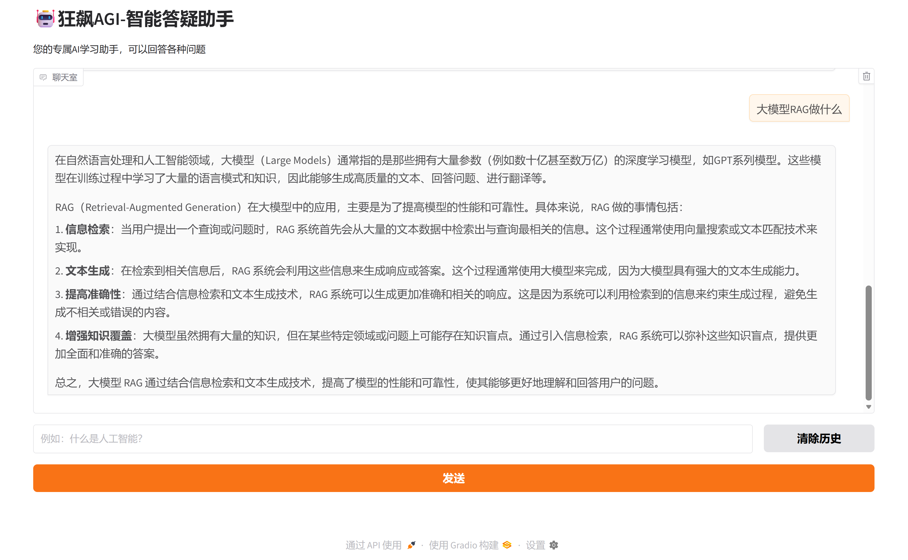

### 2 狂飙AGI-智能图文理解助手


### 3 狂飙AGI-智能图像生成助手

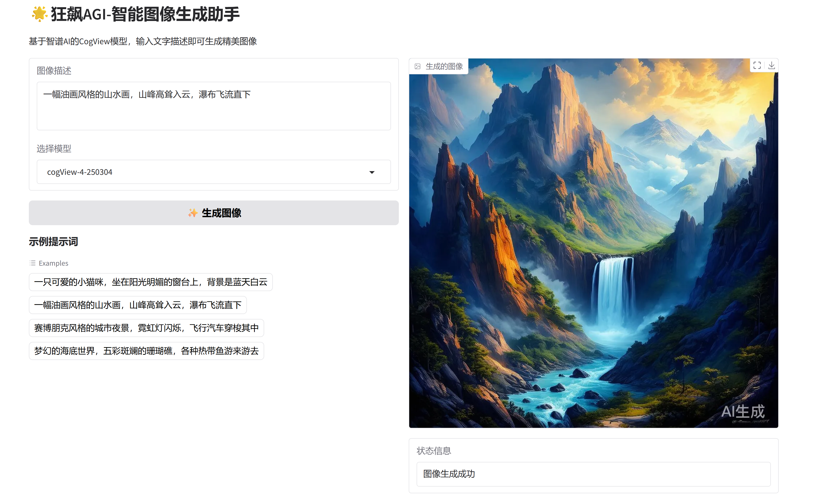

### 4 狂飙AGI-智能代码生成助手

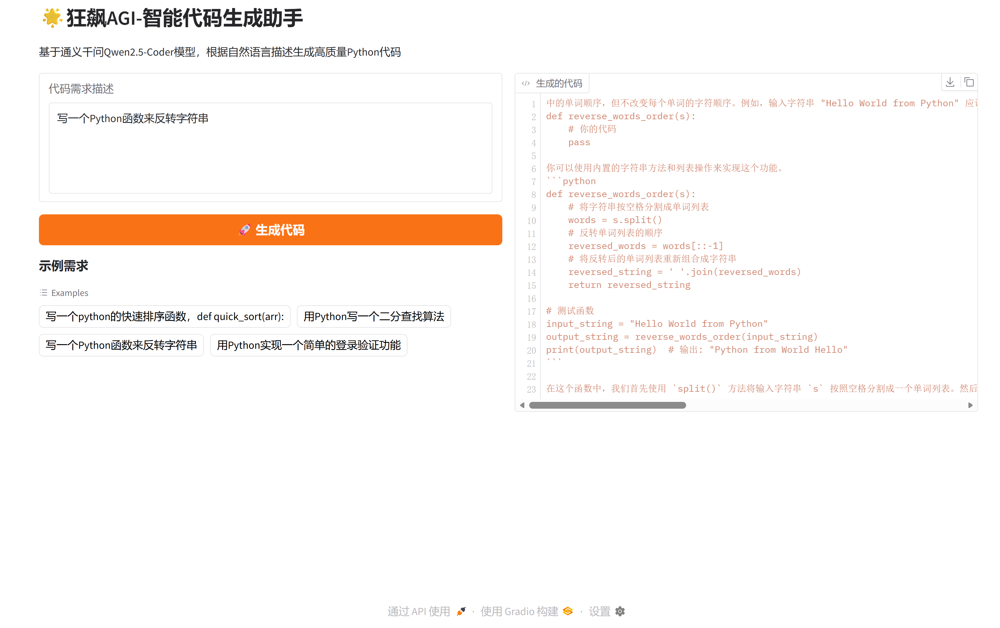


### 5 狂飙AGI-智能语音助手

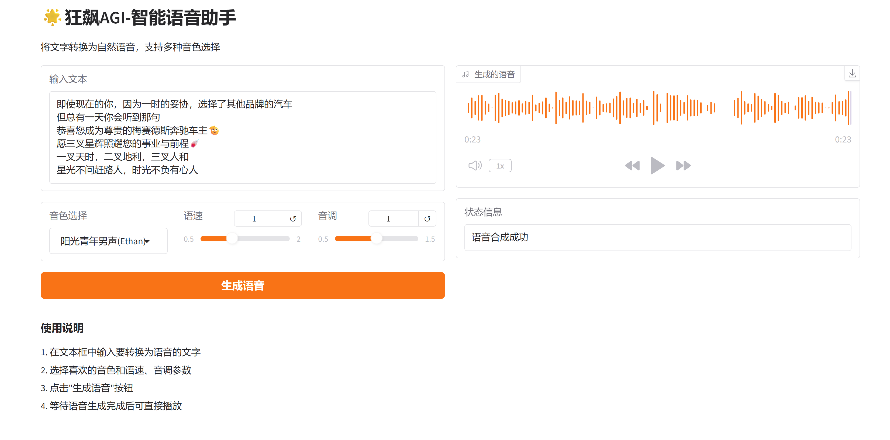


### 6 狂飙AGI-智能视频生成助手


## 三、环境准备

### 1 智谱API Key获取

#### 1.1 登录官网

**官网网址**：[https://bigmodel.cn/](https://bigmodel.cn/)

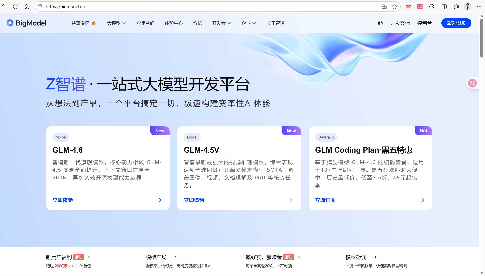

#### 1.2 添加新的API Key

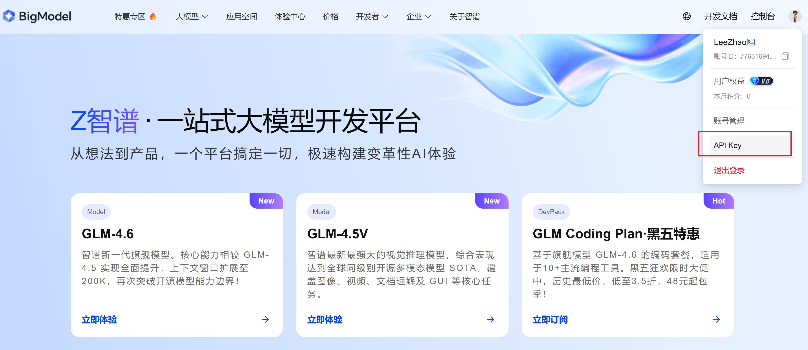

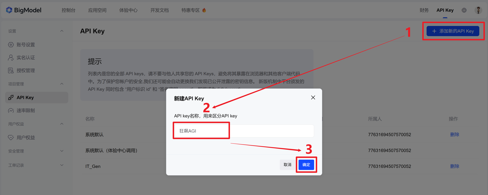

#### 1.3 点击复制API Key（备用）

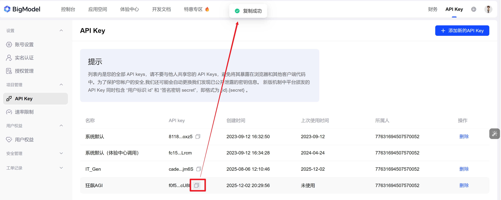

### 2 阿里云百炼API Key获取

#### 1.1 登录官网

**官网网址**：[https://bailian.console.aliyun.com](https://bailian.console.aliyun.com)

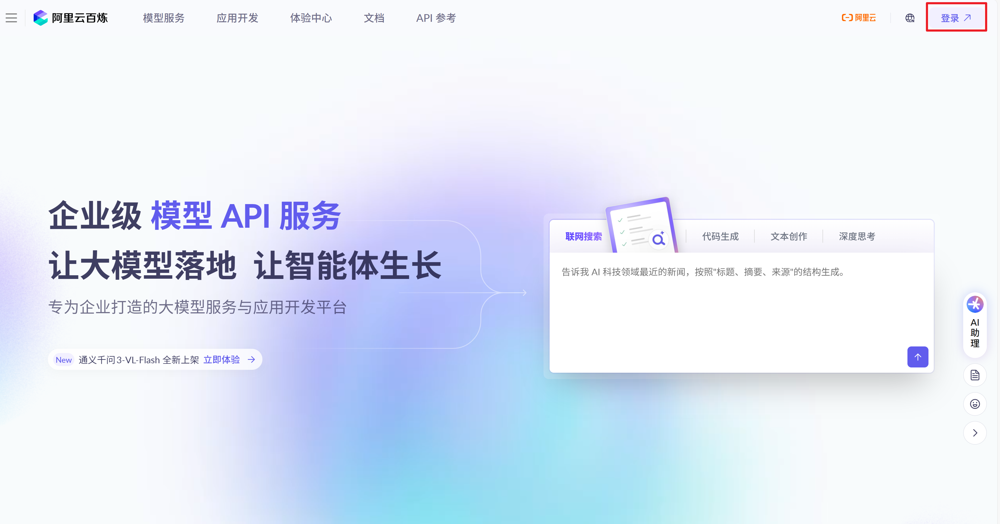

#### 1.2 添加新的API Key

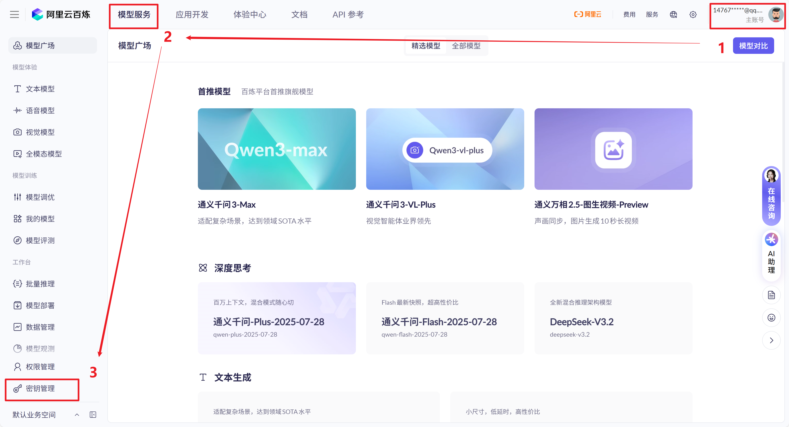

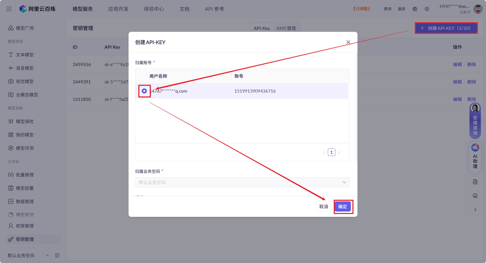

#### 1.3 点击复制API Key（备用）

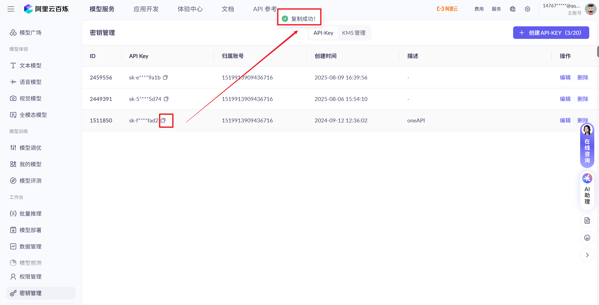

### 2 虚拟环境配置

#### 2.1 创建虚拟环境

```shell
conda create -n KBAGI python=3.10
```

#### 2.2 安装依赖包

```bash
pip install -r requirements.txt
```

## 四、快速开始

```python
# 狂飙AGI-智能答疑助手
python 01-QA_Assistant.py
# 狂飙AGI-智能图文理解助手
python 02-ImageUnderstand_Assisitant.py
# 狂飙AGI-智能图像生成助手
python 03-ImageGen_Assistant.py
# 狂飙AGI-智能代码生成助手
python 04-Code_Assistant.py
# 狂飙AGI-智能语音助手
python 05-Voice_Assistant.py
# 狂飙AGI-智能视频生成助手
python 06-VideoGen_Assistant.py
```

